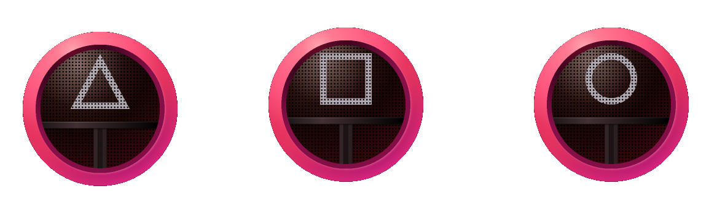

# Handover Game

Website for entertainment only! 😃

## Table of Contents

1. [Installation Instructions](#installation-instructions)
2. [Usage](#usage)

## Installation Instructions
To get the project up and running on your local machine, follow these steps:

1. Install "Live Server (Five Server)" plugin from the Visual Studio Code marketplace
2. Click on "Go Live" option on the far right of the IDEA window bottom
3. Enjoy!

## Usage
Once the website is open, you can navigate through different sections:

🎮 Game Section: Select a game to play, and follow the instructions to engage in the entertainment.